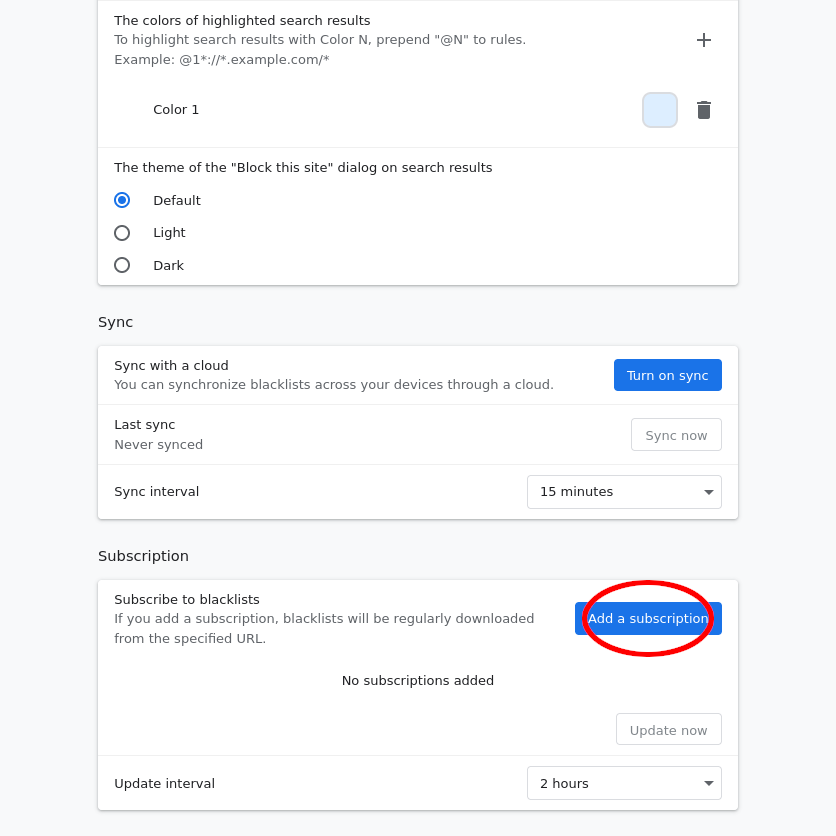
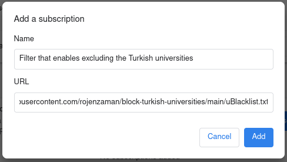

### Block Turkish universities (make academy great again)

The filter provided at this repository is compatible with [uBlacklist](https://github.com/iorate/uBlacklist), which is a browser extension available for Chromium/Chrome, Firefox, and others.

Use the following URL to subscribe.

```
https://raw.githubusercontent.com/rojenzaman/block-turkish-universities/main/uBlacklist.txt
```

### Usage

1. Install uBlacklist

 - [Chrome Web Store](https://chrome.google.com/webstore/detail/ublacklist/pncfbmialoiaghdehhbnbhkkgmjanfhe)
 - [Firefox Add-ons](https://addons.mozilla.org/en-US/firefox/addon/ublacklist/)

2. Open the uBlacklist configuration page, and then click "Add a subscription"



3. In the dialog that appears, copy and paste as follows, and then click "Add"

| Key  | Value                                                                                              |
| ---- | :------------------------------------------------------------------------------------------------- |
| Name | Filter that enables excluding the  Turkish universities                                            |
| URL  | https://raw.githubusercontent.com/rojenzaman/block-turkish-universities/main/uBlacklist.txt        |


